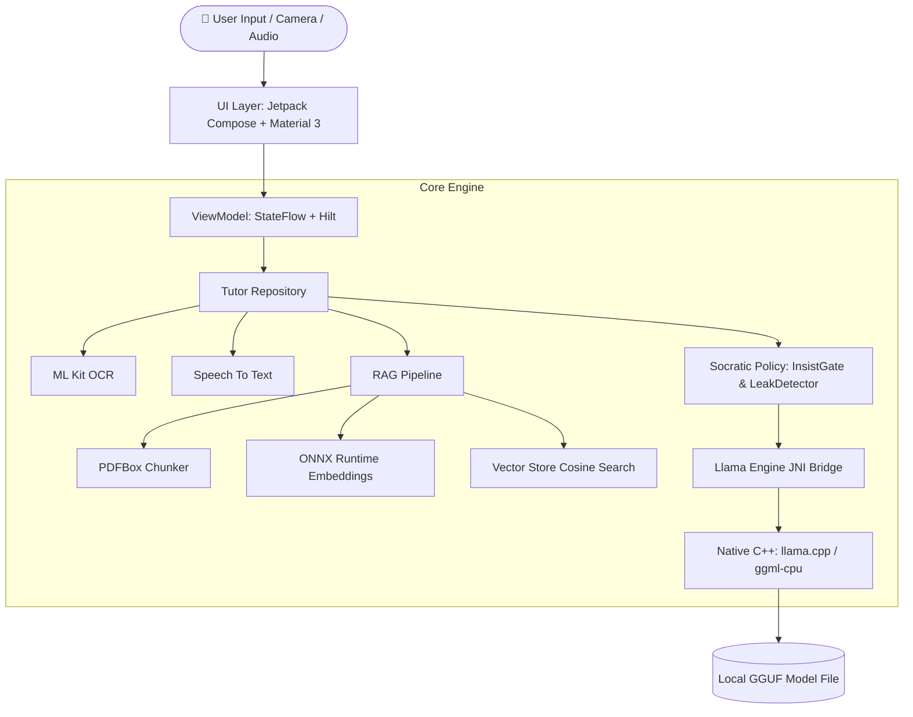

# 🎓 ariv.ai — On-Device Socratic AI Tutor

<p align="center">
  
</p>

<p align="center">
  <b>A 100% On-Device, Privacy-First Learning & Math Assistant powered by Local GGUF LLMs, On-Device Vector RAG, and Vision OCR.</b>
</p>

<p align="center">
  <a href="https://kotlinlang.org/"></a>
  <a href="https://developer.android.com/jetpack/compose"></a>
  <a href="https://github.com/ggerganov/llama.cpp"></a>
  <a href="https://onnxruntime.ai/"></a>
  <a href="https://developer.android.com/about/versions/15"></a>
</p>

---

## 🌟 Key Highlights

- **🧠 100% Offline & Private On-Device LLM**: Runs quantized GGUF models (such as Qwen3, Qwen2.5, or Llama 3) locally on ARM64 mobile hardware via native `llama.cpp` JNI integration. Zero data leaves your device.
- **🎓 True Socratic Pedagogy Engine**:
  - **Guiding Hints First**: Never spills the final answer immediately; prompts students step-by-step with guided questions.
  - **Insist Gate**: Tracks persistence and reveals complete worked solutions only after multiple genuine attempts.
  - **Answer Leak Guard**: Real-time output sanitization filters out unintended answers or raw reasoning leaks.
- **📚 On-Device Retrieval Augmented Generation (RAG)**:
  - **PDF Chunker**: Extracts and segments textbook PDFs locally using `PDFBox-Android`.
  - **Local Vector Store**: Generates vector embeddings on-device using **ONNX Runtime Mobile** and performs in-memory cosine similarity search to retrieve page-specific context and citations.
- **📷 Vision Math & OCR**: Scan textbook problems directly using **Google ML Kit Text Recognition**.
- **🎙️ Speech-to-Text Integration**: Hands-free voice input for entering complex math problems naturally.
- **📝 Automatic Quiz Generator**: Dynamically crafts interactive 3-question multiple choice quizzes based on textbook excerpts.
- **⚡ Android 15 & 16 KB Page Alignment Ready**: Native shared libraries (`libllama_android.so`, `libggml.so`) compiled with `-Wl,-z,max-page-size=16384` for maximum compatibility on modern Android devices.

---

## 🛠️ Architecture & Tech Stack



| Layer | Technologies / Libraries Used |
| :--- | :--- |
| **Language & Platform** | Kotlin 2.2, Android SDK 35/37, NDK r25 |
| **UI & Navigation** | Jetpack Compose, Material 3, Navigation Compose, Edge-to-Edge |
| **Dependency Injection** | Dagger Hilt, Hilt Navigation Compose |
| **LLM Inference Engine** | Native C++ `llama.cpp` via JNI (`libllama_android.so`), GGUF support |
| **On-Device Embeddings** | ONNX Runtime Mobile (`onnxruntime-android`) |
| **Textbook Indexing** | PDFBox-Android (`com.tom-roush:pdfbox-android`) |
| **Vision & Voice** | Google ML Kit Text Recognition, Android SpeechRecognizer |
| **Async & Streams** | Kotlin Coroutines, StateFlow, CallbackFlow streaming |

---

## 📱 App Navigation & Features

1. **Onboarding & Hardware Diagnostics**: Auto-detects available device RAM, CPU cores, and ARM64 architecture to recommend the optimal model size (e.g., 1.5B vs 4B GGUF).
2. **Textbook Library & PDF Manager**: Import PDF textbooks, index chunks, and generate instant practice quizzes based on specific chapters.
3. **Socratic AI Chat**: Stream responses with page citations, toggle hardware diagnostic status, and import custom `.gguf` weights directly.
4. **Interactive Quiz Mode**: Practice multiple-choice questions with instant feedback and explanations.

---

## ⚙️ Model Requirements & Setup

`ariv.ai` supports any quantized **GGUF** format model (Q4_K_M recommended).

### Recommended Models:
- **Lightweight (Recommended for most devices)**: `Qwen2.5-1.5B-Instruct-Q4_K_M.gguf` (~950 MB)
- **High Accuracy (For devices with 6GB+ RAM)**: `Qwen3-4B-Instruct-Q4_K_M.gguf` (~2.5 GB)

### Installing a Model on Device:
1. Download any `.gguf` model file to your mobile device.
2. Open **ariv.ai**, tap the **Model Diagnostics (ℹ️)** button on the Chat Screen, and select **Load Custom GGUF File**.
3. *Fallback*: If no GGUF file is supplied, `ariv.ai` automatically runs in a lightweight, rule-based **Socratic Demo Mode** for zero-setup demonstration.

---

## 🚀 Building & Running from Source

### Prerequisites:
- Android Studio Ladybug (2024.2.1+) or newer
- Android NDK r25+
- CMake 3.22.1+

### Build Steps:
```bash
# 1. Clone the repository
git clone https://github.com/your-username/ariv.ai.git
cd ariv.ai

# 2. Open project in Android Studio and sync Gradle
./gradlew assembleDebug

# 3. Deploy to an ARM64 Android device (API 26+)
```

---

## 📄 License

Distributed under the MIT License. See `LICENSE` for more information.
